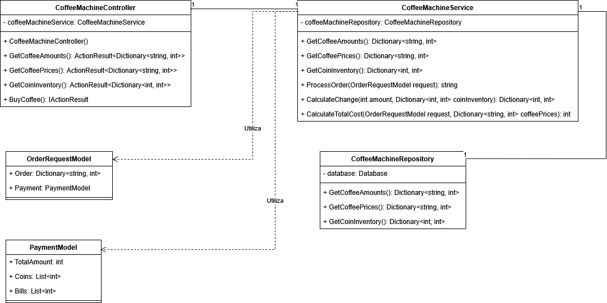
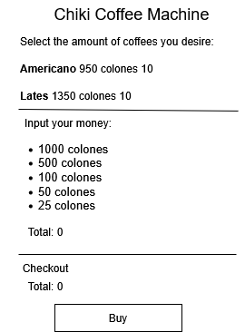

# Exam 2 - Part 2:

- Josué David Badilla Paredes - C00870


### Class diagram created after the refactor:



### Frontend mockup:



-----------------------------------------------------------------------------------
# Backend:

The backend was developed in ASP.NET using a layered architetcure to separate
responsabilities and functionalities. Models are used to represent domain entities.

To execute the frontend, open the inlcuded .proj file and run it via Visual Studio.

By default, the backend runs at port 7071.


-----------------------------------------------------------------------------------
# Frontend:

The frontend uses Vue.js, version 3. It also uses Axios to perform backend request 
operations. Make sure to install this dependency before executing the frontend.

The front by default runs at port 8080.


```sh
npm install axios
```


### Execute the frontend:
Locate the folder, 'frontend', open a terminal and input the following command:
```sh
npm run serve
```
